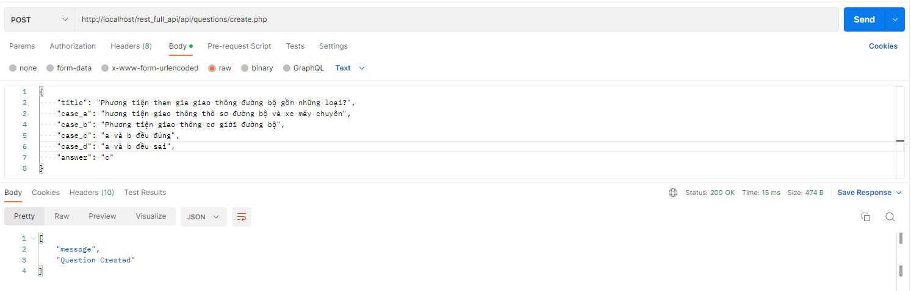
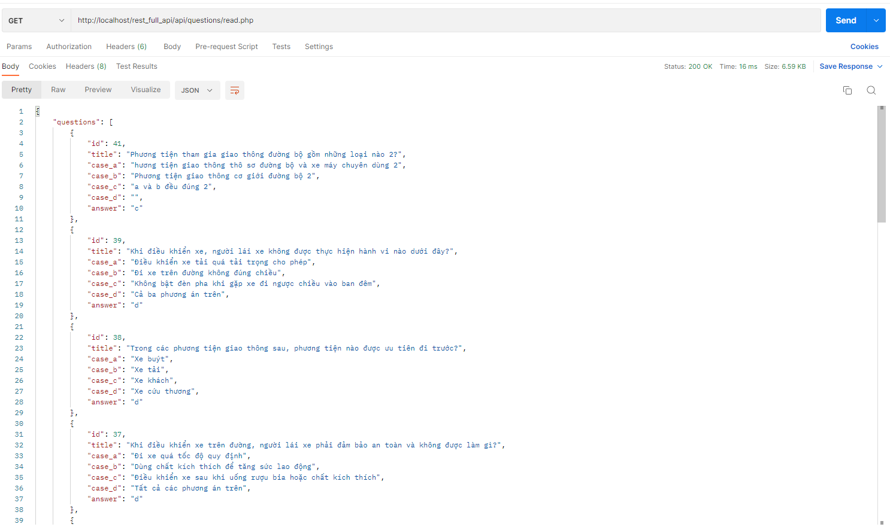
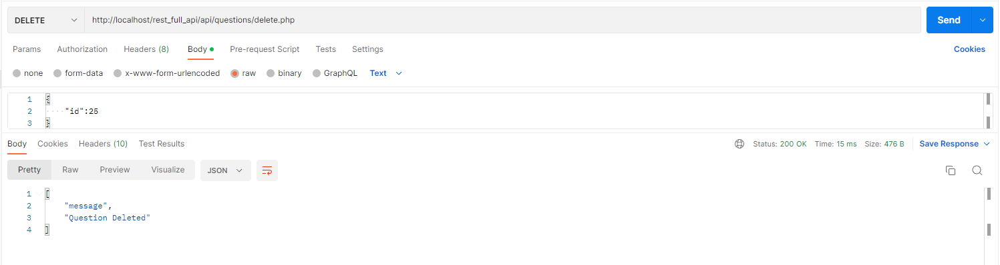
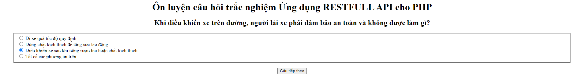
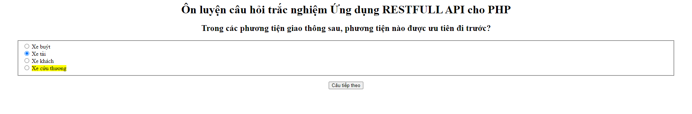
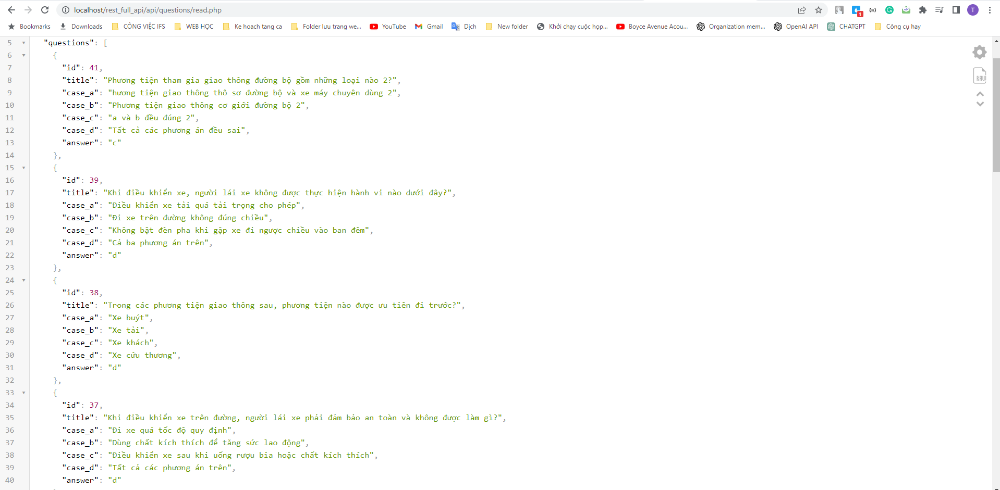

Project created to learn restfull API with PHP and MySQL
## Restfull API + MySQL PDO 
##C: 
link http://localhost/rest_full_api/api/questions/create.php
#Ảnh minh họa:  

##R:
    link http://localhost/rest_full_api/api/questions/read.php
Ảnh minh họa:  

##U: 
link http://localhost/rest_full_api/api/questions/update.php
Ảnh minh họa:  

##D: 
link http://localhost/rest_full_api/api/questions/delete.php

#Manual
Use fetch API to get data from http://localhost/rest_full_api/api/questions/read.php
Bấm bắt đầu => chọn đáp án => Next => submit => Trả kết quả => Xem lại => Next để xem => Xem lại .....
#Ảnh minh họa app khi làm bài

#Ảnh minh họa app khi chekc đáp án

#API
